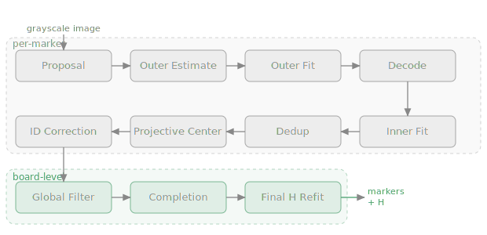

# Pipeline Overview

The ringgrid detection pipeline transforms a grayscale image into a set of identified marker detections with sub-pixel centers, fitted ellipses, decoded IDs (coded targets) or lattice coordinates (plain targets), and an optional board-to-image homography. The pipeline is structured in two major phases executed in sequence, with projective center correction and structural ID correction in finalize.

The pages below describe the **coded** path (16-sector coded rings, the classic hex board). [Plain (uncoded) targets](#plain-target-path) share the fit and projective-center stages but replace the decode-driven back half with grid labeling and origin anchoring. Which combinations run which path is summarized in the [target composition matrix](../targets/target-model.md#composition-matrix--how-each-combination-detects).

## Two-Phase Architecture

### Phase 1: Fit-Decode

Orchestrated by `pipeline/fit_decode.rs`, this phase takes raw proposals and produces individually decoded markers:

| Stage | Name | Description |
|-------|------|-------------|
| 1 | [Proposal](proposal.md) | Scharr gradient voting + NMS produces candidate centers |
| 2 | [Outer Estimate](outer-estimate.md) | Radial profile peak detection yields radius hypotheses |
| 3 | [Outer Fit](outer-fit.md) | RANSAC ellipse fitting on sampled edge points |
| 4 | [Decode](decode.md) | 16-sector code sampling and codebook matching |
| 5 | [Inner Estimate](inner-estimate.md) | Inner ring ellipse fitting from outer prior |
| 6 | [Dedup](dedup.md) | Spatial and ID-based deduplication |

Stages 2--5 are executed per-proposal inside `process_candidate()`. A proposal that fails at any stage is rejected with a diagnostic reason string. Successfully built markers are collected, then deduplicated in stage 6.

### Phase 2: Finalize

Orchestrated by the `pipeline/finalize/` module, this phase applies global geometric reasoning to improve and extend the detection set. The coded path (`finalize/coded.rs`) runs:

| Order | Name | Description |
|-------|------|-------------|
| 1 | [Projective Center](projective-center.md) | Correct fit-decode marker centers (once per marker) |
| 2 | [ID Correction](id-correction.md) | Structural consistency scrub/recovery of decoded IDs (hex coded targets only) |
| 3 | [Global Filter](projective-center.md#global-filter) | Optional RANSAC homography from decoded markers with known board positions |
| 4 | [Completion](completion.md) | Optional conservative fits at missing H-projected IDs (+ projective center for new markers) |
| 5 | [Final H Refit](completion.md#final-homography-refit) | Optional refit homography from all corrected centers |
| 6 | [Geometric Verify](#geometric-verification) | Precision-first lattice-consistency gate; removes geometrically impossible markers |

When `use_global_filter` is `false`, finalize still runs projective center + ID correction, then returns immediately, skipping the homography-dependent stages (global filter/completion/final refit/geometric verify).

Plain (uncoded) targets take a different back half — see [Plain-Target Path](#plain-target-path).

## Geometric Verification

After the final homography, a precision-first gate (`pipeline/geometric_verify.rs`, enabled by `advanced.geometric_verify`, default `true`) checks every labeled marker against the target lattice and **removes** the geometrically inconsistent ones, so only trusted board correspondences reach the output. Two complementary tests run, rejecting on their union:

1. **Local lattice-midpoint** (homography-free, distortion-robust primary): each marker's center versus the midpoint predicted by its lattice neighbors. Being locally affine, it sees only second-difference curvature under smooth lens distortion, while a wrong-cell marker sits ~1 pitch off.
2. **Global final-H reprojection** (gross-blunder backstop): each marker's center versus its board position projected through the final homography. Catches boundary markers that lack a complete neighbor pair for the local test.

Both thresholds adapt to the observed inlier-residual distribution (`max(floor, median + k·MAD)`), so the gate stays recall-safe on clean and distorted boards alike. It is lattice-generic and coordinate-keyed, so it applies to coded and plain targets identically. See [Detection Quality & Rejection](../detection-quality.md).

## Plain-Target Path

Plain (uncoded) rings carry no IDs, so the coded path's decode → ID correction →
global filter cannot label them. The plain finalize path
(`pipeline/finalize/plain.rs`) replaces the decode-anchored stages with
coordinate-keyed grid labeling and origin anchoring. The full walkthrough —
grid assignment, origin resolution, completion, and the absolute/relative frame
contract — is on its own page: **[Plain / Rect Target
Detection](plain-target.md)**.

## Projective Center Correction

Projective center correction recovers the true projected center of a ring marker from its inner and outer ellipse pair, compensating for the perspective bias inherent in ellipse center estimation. It is applied **once per marker** at two points in the pipeline:

1. **Before global filter:** Corrects all fit-decode markers so that downstream geometric stages operate on unbiased centers.
2. **After completion:** Newly added completion markers receive their own correction. Only the slice of markers added since the last correction is processed.

Each marker is corrected exactly once. `apply_projective_centers()` from `detector/center_correction.rs` requires both inner and outer ellipses. Markers without a valid inner ellipse are skipped.

## Pipeline Entry Points

All detection is accessed through the `Detector` struct in `api.rs`, which delegates to the entry points in `pipeline/run.rs`:

### `detect_single_pass`

The simplest mode. Runs proposal generation followed by the full fit-decode and finalize pipeline without any pixel mapper:

```
proposals = find_proposals(gray, config)
fit_markers = fit_decode::run(gray, config, None, proposals)
result = finalize::run(gray, fit_markers, config, None)
```

### `detect_with_mapper`

Two-pass detection with an external pixel mapper (e.g., from known camera intrinsics):

1. **Pass 1:** Run `detect_single_pass` without the mapper to get initial detections.
2. **Pass 2:** Extract seed proposals from pass-1 detections, then re-run the full pipeline with the mapper active.

The mapper transforms between image pixel coordinates and a distortion-corrected "working" coordinate frame. During pass 2, edge sampling and decoding operate in working space, producing more accurate fits under lens distortion. Final marker centers are mapped back to image space; the homography lives in the working frame.

### `detect_with_self_undistort`

Estimates a division-model distortion correction from the detected markers, then optionally re-runs detection with the estimated mapper:

1. **Baseline pass:** Run `detect_single_pass`.
2. **Self-undistort estimation:** If enabled and enough markers with edge points are available, estimate a `DivisionModel` mapper from the ellipse edge points.
3. **Pass 2 (conditional):** If estimation succeeded, re-run as a seeded pass-2 with the estimated mapper.

The self-undistort result is attached to `DetectionResult.self_undistort` regardless of whether pass 2 was applied.

### `detect_adaptive` and `detect_multiscale`

Adaptive scale entry points run the same fit/decode and finalize logic, but over
one or more scale tiers:

1. Build tiers (automatic probe, hint-derived, or explicit).
2. Run per-tier fit/decode + projective center + ID correction.
3. Merge markers across tiers with size-aware dedup.
4. Run global filter + completion + final homography refit once.

See [Adaptive Scale Detection](../detection-modes/adaptive-scale.md).

## Seed Injection in Two-Pass Modes

When a pass-2 runs (either `detect_with_mapper` or `detect_with_self_undistort`), pass-1 detection centers become seed proposals for pass-2. Seeds are injected with a high score (`seed_score = 1e12` by default) so they are prioritized during candidate selection. The `SeedProposalConfig` configuration controls:

- `merge_radius_px`: Radius for merging seeds with detector-found proposals (default: 3.0 px).
- `max_seeds`: Optional cap on the number of seeds consumed (default: 512).

## Coordinate Frames

The pipeline maintains two coordinate frames:

- **Image frame:** Raw pixel coordinates in the input image.
- **Working frame:** Distortion-corrected coordinates when a `PixelMapper` is active; identical to image frame when no mapper is present.

Edge sampling, ellipse fitting, decoding, and homography estimation all operate in the working frame. The final `DetectedMarker.center` is always in image space. When a mapper is active, `center_mapped` preserves the working-frame center, and `homography_frame` is set to `DetectionFrame::Working`.

## Output Structure

The pipeline produces a `DetectionResult` containing:

- `detected_markers`: The final list of `DetectedMarker` structs.
- `homography`: Optional 3x3 board-to-image homography matrix.
- `ransac`: Optional `RansacStats` for the homography fit.
- `image_size`: Dimensions of the input image.
- `center_frame`: Always `DetectionFrame::Image`.
- `homography_frame`: `Image` or `Working` depending on mapper presence.
- `self_undistort`: Optional self-undistort estimation result.

For the serialized JSON shape used by the CLI and examples, see
[Detection Output Format](../output-format.md).



**Source:** `pipeline/run.rs`, `pipeline/fit_decode.rs`, `pipeline/finalize/` (`coded.rs`, `plain.rs`, `common.rs`), `pipeline/assign.rs`, `pipeline/anchor.rs`, `pipeline/geometric_verify.rs`
