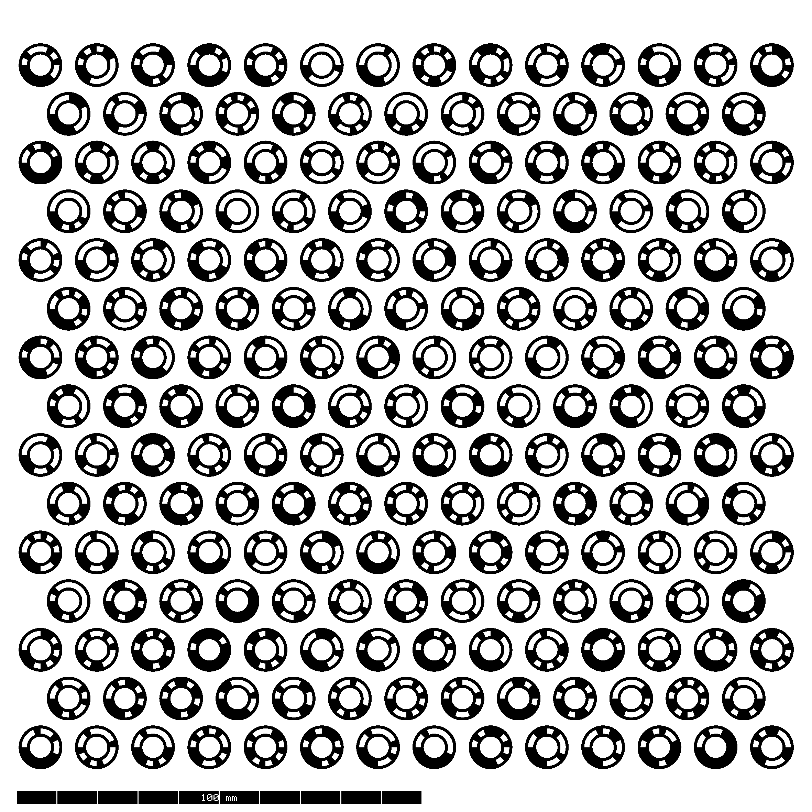
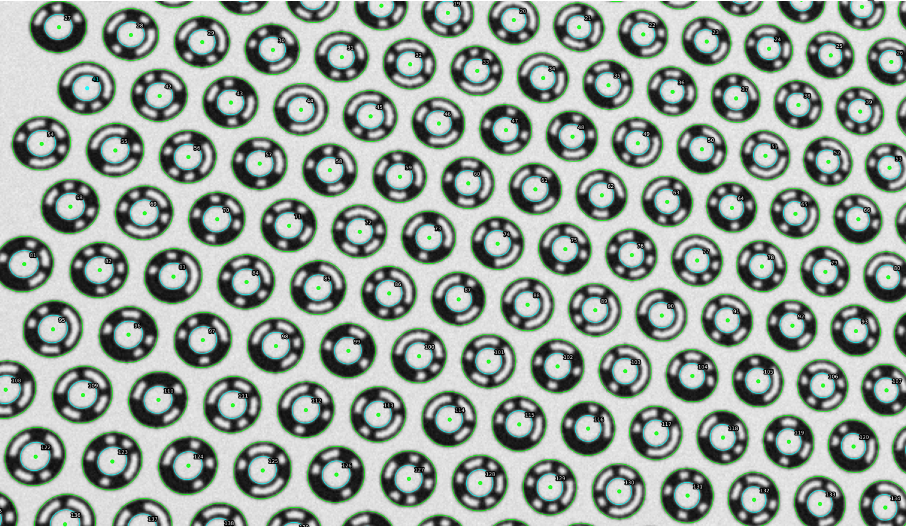

# Introduction

**ringgrid** is a pure-Rust library for detecting dense ring calibration targets. It detects markers with subpixel accuracy, decodes unique IDs from the shipped baseline 893-codeword profile (with an opt-in extended profile available for larger ID spaces), estimates a board-to-image homography, and returns structured results ready for downstream camera calibration.

Since 0.8, targets are described compositionally rather than as a single fixed layout: a hex or rect lattice, coded (16-sector, ID-bearing) or plain rings, and optional origin fiducials for plain targets that carry no per-marker identity. See [The Compositional Target Model](targets/target-model.md) for the full picture.

> *No OpenCV bindings — all image processing is implemented in Rust.*

| Printable target | Detection overlay |
|---|---|
|  |  |

## The Problem

Camera calibration requires detecting fiducial markers — known patterns printed on a calibration target — with high geometric precision. Traditional approaches use checkerboard corners or square markers (ArUco). These patterns have limitations:

- **Checkerboards** provide subpixel corner accuracy but carry no per-corner identity, making automatic correspondence ambiguous when the full board is not visible.
- **Square markers** (ArUco, AprilTag) encode identity in a binary grid, but their corners are detected via contour intersection, which limits subpixel precision.

ringgrid introduces a different target design: **concentric ring markers** with binary-coded sectors, arranged on a hex lattice.

## The Solution

Each ringgrid marker consists of two concentric rings — an outer ring and an inner ring — separated by a 16-sector binary code band that encodes a unique ID. This design provides three key advantages:

1. **Subpixel edge detection.** Ring boundaries produce strong, omnidirectional intensity gradients. The detector samples edge points along radial rays and fits an ellipse using the Fitzgibbon direct least-squares method, achieving center localization well below one pixel.

2. **Projective center correction.** Under perspective projection, the center of a fitted ellipse is *not* the true projected center of the circle. ringgrid fits both the outer and inner ring ellipses and uses their conic pencil to recover the unbiased projected center — without requiring camera intrinsics.

3. **Large identification capacity.** The 16-sector binary code band ships with a stable 893-codeword baseline profile at minimum cyclic Hamming distance 2, plus an opt-in 2180-codeword extended profile when larger ID capacity matters more than the baseline ambiguity guarantee without introducing new polarity ambiguity beyond the shipped baseline.

## What You Get

The detector returns a `DetectionResult` containing:

- A list of `DetectedMarker` structs, each with:
  - Decoded ID (from the active codebook profile; baseline by default)
  - Subpixel center in image coordinates
  - Board coordinates in millimeters when the ID is valid for the active layout
  - Fitted outer and inner ellipses
  - Quality metrics (fit residuals, decode confidence) and detection source
- A board-to-image homography (when enough markers are decoded)
- Coordinate frame metadata describing the output conventions

See [Detection Output Format](output-format.md) for the exact JSON shape written
by the CLI and the corresponding Rust `DetectionResult` fields.

## Detection Modes

ringgrid supports four high-level detection modes:

1. **Simple detection** — single-pass detection in image coordinates. No distortion correction.
2. **Adaptive scale detection** — multi-tier detection that auto-selects scale bands (or uses explicit tiers) for scenes with large marker size variation.
3. **External pixel mapper** — two-pass detection using a user-provided coordinate mapping (e.g., camera distortion model). Pass-1 finds seed positions, pass-2 refines in the undistorted working frame.
4. **Self-undistort** — automatic estimation of a single-parameter division distortion model from the detected ellipses, followed by a corrected second pass. No external calibration required.

## Who This Is For

This book is for engineers integrating high-precision fiducial detection into:

- Camera calibration pipelines
- Photogrammetry and 3D reconstruction
- Computer vision applications requiring high-precision fiducial detection
- Metrology and measurement systems

ringgrid is a Rust library, but you do not have to write Rust to use it: it also
ships Python, C/C++, and WebAssembly bindings and a command-line tool — see
[Language Bindings](bindings/overview.md).

## Book Structure

- **Fast Start** — one-command workflow to generate `target_spec.json` + printable SVG/PNG and run first detection
- **Targets** — the compositional target model: hex/rect lattices, coded/plain marker rings, optional origin fiducials
- **Marker Design** — anatomy of the ring marker, coding scheme, and hex lattice layout
- **Detection Pipeline** — a walkthrough of every detection stage
- **Mathematical Foundations** — full derivations of the core algorithms (ellipse fitting, RANSAC, homography, projective center recovery, division model)
- **Using ringgrid** — configuration, output types, detection modes, and CLI usage
- **Language Bindings** — Python, C/C++, and WebAssembly/npm

Upgrading across a pre-1.0 release? Per-interface migration notes live in
[`docs/migrations/`](https://github.com/VitalyVorobyev/ringgrid/tree/main/docs/migrations).
