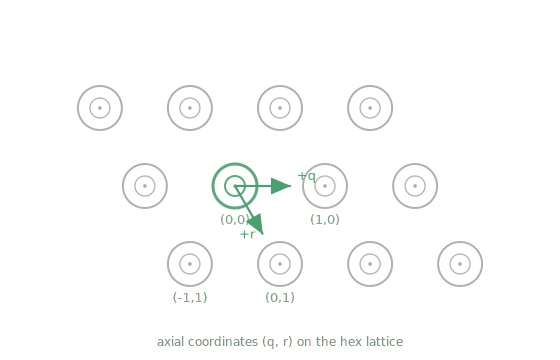

# Hex Lattice Layout

Ringgrid markers are arranged on a hexagonal lattice, which provides denser
packing than a rectangular grid and ensures that each marker has six equidistant
neighbors. The lattice geometry is parametrized by three values -- rows, columns,
and pitch -- and marker positions are computed at runtime from these parameters
rather than stored as explicit coordinate lists.

## Lattice parameters

The hex lattice is fully defined by three parameters:

| Parameter | Default | Description |
|-----------|---------|-------------|
| `rows` | 15 | Number of marker rows |
| `long_row_cols` | 14 | Number of markers in a long row |
| `pitch_mm` | 8.0 mm | Center-to-center distance between adjacent markers |

Rows alternate between **long rows** (with `long_row_cols` markers) and
**short rows** (with `long_row_cols - 1` markers). This staggering is what
produces the hexagonal packing pattern.

For the default board (15 rows, 14 long-row columns), the total marker count
is:

```
8 long rows * 14 + 7 short rows * 13 = 112 + 91 = 203 markers
```

## Axial coordinate system

Each marker position on the lattice is identified by a pair of **axial
coordinates** `(q, r)`, following the standard hex grid convention:

- **r** is the row index, centered around zero. For a board with 15 rows,
  `r` ranges from -7 to +7.
- **q** is the column index within each row, also centered around zero. The
  range of `q` depends on the row length.

Axial coordinates are integers and provide a natural addressing scheme for
hex grids. Each generated cell carries its coordinate as `TargetCell::coord`
(a `projective_grid::Coord { u, v }`, where `u = q` and `v = r` for a hex
lattice).

## Cartesian conversion

The conversion from axial coordinates `(q, r)` to Cartesian positions in
millimeters uses the standard hex-to-Cartesian transform:

```
x = pitch * (sqrt(3) * q + sqrt(3)/2 * r)
y = pitch * (3/2 * r)
```

In Rust, this is implemented as:

```rust
fn hex_axial_to_xy_mm(q: i32, r: i32, pitch_mm: f32) -> [f32; 2] {
    let qf = q as f64;
    let rf = r as f64;
    let pitch = pitch_mm as f64;
    let x = pitch * (f64::sqrt(3.0) * qf + 0.5 * f64::sqrt(3.0) * rf);
    let y = pitch * (1.5 * rf);
    [x as f32, y as f32]
}
```

The computation is performed in `f64` to avoid accumulation of rounding errors
across large boards, then truncated to `f32` for the final coordinates.

After generation, all marker positions are translated so that the first marker
(top-left corner) sits at the origin `(0, 0)`.



## Nearest-neighbor distance

On this hex lattice, the nearest-neighbor distance between adjacent marker
centers is:

```
d_nn = pitch * sqrt(3) ≈ 8.0 * 1.732 ≈ 13.86 mm
```

This distance determines the minimum clearance between markers and constrains
the maximum allowed marker diameter (see
[Ring Structure](ring-structure.md#design-constraints)).

## The `TargetLayout` type

At runtime a calibration target is described by a `TargetLayout`, the
compositional model introduced in 0.8. A hex board is one point in that model:
its lattice aspect is `LatticeGeometry::Hex`, its rings are a shared
`RingGeometry`, and (for coded boards) its coding is `MarkerCoding::Coded16`.
The [Compositional Target Model](../targets/target-model.md) covers the full
space (rect lattices, plain rings, origin fiducials); this page stays on the hex
lattice.

The hex lattice parameters from the table above live in `HexGeometry`:

```rust
use ringgrid::{TargetLayout, LatticeGeometry};

// The classic 15-row, 203-marker coded board.
let target = TargetLayout::default_hex();
assert_eq!(target.n_cells(), 203);
assert_eq!(target.pitch_mm(), 8.0);

if let LatticeGeometry::Hex(hex) = target.lattice() {
    assert_eq!(hex.rows, 15);
    assert_eq!(hex.long_row_cols, 14);
}
```

Construct a hex target with `TargetLayout::default_hex()`, from direct geometry
with `TargetLayout::coded_hex(pitch_mm, rows, long_row_cols, outer_radius_mm,
inner_radius_mm, ring_width_mm)`, the general `TargetLayout::new(...)`, or a JSON
loader. Geometry is not mutated in place: construction derives a cell cache
(positions and ID/coordinate lookups) that an in-place edit would silently
desync.

Key methods (hex-relevant):

| Method | Returns | Description |
|--------|---------|-------------|
| `default_hex()` | `TargetLayout` | Classic 15×14 hex board, 203 coded markers |
| `coded_hex(pitch, rows, long_row_cols, outer, inner, ring_width)` | `Result<TargetLayout, _>` | Coded hex from direct geometry |
| `from_json_file(path)` | `Result<TargetLayout, TargetLoadError>` | Load a target spec (v5, or legacy v4) |
| `cells()` | `&[TargetCell]` | All marker cells in generation order |
| `n_cells()` | `usize` | Total number of marker cells |
| `cell_xy_mm(coord)` | `Option<[f32; 2]>` | Cell center by axial coordinate |
| `xy_mm_of_id(id)` | `Option<[f32; 2]>` | Cell center by codebook ID (coded) |
| `id_of(coord)` / `coord_of_id(id)` | `Option<_>` | Coordinate ↔ ID lookups (coded) |
| `marker_ids()` | `impl Iterator<Item = usize>` | Iterate codebook IDs (empty for plain) |
| `marker_bounds_mm()` / `marker_span_mm()` | `Option<_>` | Cell-center bounding box / span |
| `pitch_mm()` / `min_center_spacing_mm()` | `f32` | Lattice pitch and nearest-neighbor spacing |

Lookups are O(1): `TargetLayout` builds ID→cell and coordinate→cell hash maps
during construction.

## The `TargetCell` type

Each cell generated for the lattice is a `TargetCell`:

```rust
pub struct TargetCell {
    /// Lattice coordinate: axial (q, r) for hex, carried as Coord { u, v }.
    pub coord: projective_grid::Coord,
    /// Cell center in board-frame millimeters.
    pub xy_mm: [f32; 2],
    /// Codebook ID for coded targets; None for plain targets.
    pub id: Option<usize>,
}
```

For a hex board, `coord.u` is the axial `q` and `coord.v` is the axial `r`.
Cells are generated top row first, left to right; for coded boards the `id` is
the codebook index (0 through 892 for the default board), assigned sequentially
in that order unless the target carries an explicit `id_assignment`.

## JSON schema

Targets are specified in JSON. The canonical schema is
[`ringgrid.target.v6`](../targets/target-json-v6.md), whose `lattice` section is
tagged `"kind": "hex"` for a hex board. The pre-0.8 flat `ringgrid.target.v4`
schema (top-level `pitch_mm`, `rows`, `long_row_cols`, `marker_*_mm`) is still
accepted on input and migrated on load; writers always emit v5.

A minimal v5 hex spec:

```jsonc
{
  "schema": "ringgrid.target.v5",
  "name": "ringgrid_200mm_hex",
  "lattice": { "kind": "hex", "rows": 15, "long_row_cols": 14, "pitch_mm": 8.0 },
  "marker": { "outer_radius_mm": 4.8, "inner_radius_mm": 3.2 },
  "coding": { "kind": "coded16", "ring_width_mm": 1.152 }
}
```

See [Target JSON (schema v6)](../targets/target-json-v6.md) for the full field
reference and v4 auto-migration.

## Validation rules

`TargetLayout::new` (and the JSON loaders) reject illegal hex geometry up front:

1. **Positive dimensions**: `pitch_mm`, both ring radii, and (for coded targets)
   `ring_width_mm` must be finite and positive.
2. **Inner < outer**: the inner radius must be strictly less than the outer
   radius.
3. **Positive code band**: for coded markers, the outer edge of the inner ring
   stroke must stay inside the inner edge of the outer ring stroke, so the code
   band has non-zero width.
4. **Non-overlapping markers**: the drawn marker diameter (including ring stroke)
   must be smaller than the minimum center spacing (`pitch * sqrt(3)` for hex).
5. **Sufficient columns**: when `rows > 1`, `long_row_cols` must be at least 2
   (to allow short rows with `long_row_cols - 1 >= 1` markers).
6. **Codebook capacity**: a coded target may not have more cells than the
   embedded codebook (893 codewords).

## Board generation

Hex board specs can be produced by the Python utility `tools/gen_board_spec.py`,
which writes a v4 `board_spec.json` (loaders migrate it to v5 automatically):

```bash
.venv/bin/python tools/gen_board_spec.py \
    --pitch_mm 8.0 \
    --rows 15 \
    --long_row_cols 14 \
    --board_mm 200.0 \
    --json_out tools/board/board_spec.json
```

Load the result at runtime with `TargetLayout::from_json_file()`, or skip the
file entirely and use `TargetLayout::default_hex()` for the standard 15×14 board.
For the pure-Rust CLI generator — which writes a v5 `target_spec.json` plus
printable SVG/PNG and also handles rect and plain targets — see
[Target Generation](../target-generation.md).
